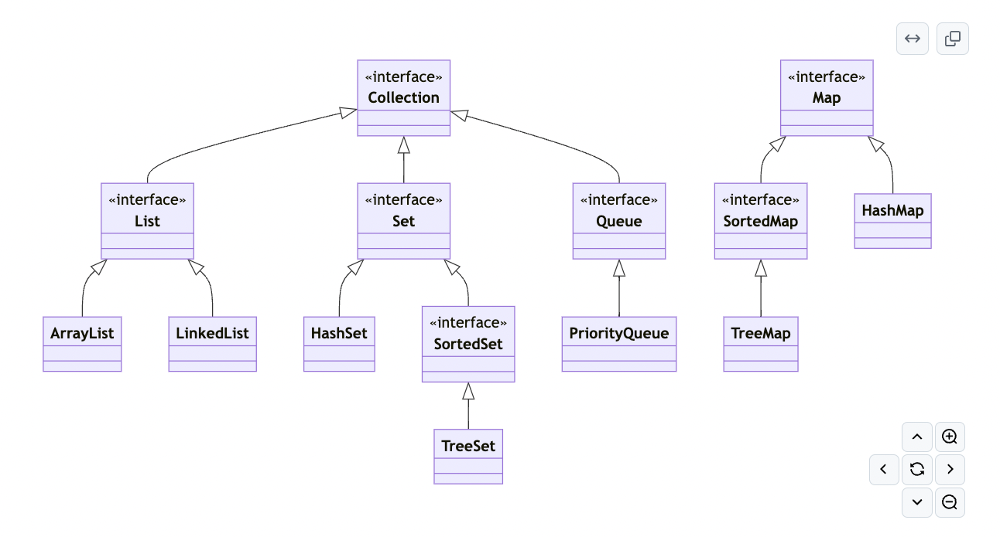

# Welcome to CS 5004

*Credit to Mark Miller for much of the content presented in this course!*

---

## Week 7

- Lecture Thursday, guest on Friday
- Project 3 questions?
- SOLID design
- JSON
- Collections (if time)

---

## SOLID Design Principles

- Acronym describing good design practices
- Popularized ~2000 by Robert Martin aka "Uncle Bob"
- SOLID
  * Single Responsibility
  * Open Closed Principle
  * Liskov Substitution Principle
  * Interface Segregation Principle
  * Dependency Inversion Principle


---

## SOLID resources

- [Clean Architecture](https://learning.oreilly.com/library/view/clean-architecture-a/9780134494272/part3.xhtml)
- [Examples used here](https://medium.com/@cibofdevs/understanding-solid-principles-in-java-with-real-life-examples-d6fe93b0acc2)
- [Barbara Liskov](https://medium.com/@cibofdevs/understanding-solid-principles-in-java-with-real-life-examples-d6fe93b0acc2)

---

## S: Single Responsibility

### A module should be responsible to one, and only one, actor.

---

## Example

- User class: getName; getEmail; saveToFile
  * User manages user data *and* handles file storage!
- Better
  * User: getName; getEmail
  * UserFileManager: saveToFile(User user)

---

## Another Example

- Lab 4
- `Clothing`: `discountClothing(List<Product> products)`
- Clothing manages clothing information and can apply a discount to the inventory

---

## O: The Open Closed Principle (OCP)

### A module should be open for extension but closed for modification.

---

## Example

- DiscountCalculator: calculateDiscount

```java
public double calculateDiscount(String customerType, double amount) {
    if (customerType.equals("Regular")) {
        return amount * 0.1;
    } else if (customerType.equals("Premium")) {
        return amount * 0.2;
    }
    return 0;
}
```

---

## Improvement

```java
public abstract class Discount {
    public abstract double calculate(double amount);
}

public class RegularDiscount extends Discount {
    public double calculate(double amount) {
        return amount * 0.1;
    }
}

...
```

---

## Another Example

- `runPayroll`

```java
if (employeeType.equals("HOURLY")) {

} else if (employeeType.equals("SALARY")) {

}
```

---

## L: The Liskov Substitution Principle (LSP)

### Subclasses should be substitutable for their base classes.

---

## Examples

- Subclass implementations of methods must adhere to the same contract as the
  superclass implementation
  * Allows backward compatibility
- `PositiveAdder` has a more restrictive precondition
- It is also a violation if there is a less restrictive postcondition.
  * A method may now return a negative number.

---

## I: The Interface Segregation Principle (ISP)

### Many client specific interfaces are better than one general purpose interface

---

## Example

```java
public interface Printer {
    void printDocument();
    void scanDocument();
    void faxDocument();
}
```
 
 All Printers have to provide all three operations!

---

```java
public interface Printer {
    void printDocument();
}
public interface Scanner {
    void scanDocument();
}
public interface Fax {
    void faxDocument();
}
public class SimplePrinter implements Printer {
}
public class MultiFunctionPrinter implements Printer, Scanner, Fax {
}
```

---

## D: The Dependency Inversion Principle (DIP)

### Depend upon Abstractions. Do not depend upon concretions.

---

## Example

- Consider the Market Place example
- Add an `InventoryManagerService` that has a method `findExpensiveItems`. The
  method returns a list of items in the inventory that exceed a certain price.
- Should the method take a list of `Product`, `Clothing`, or `Electronics`?
- `Product` allows us to extend the program to include other types of products
  without changing the inventory service method.

---

## JSON

- [Javascript Object Notation](https://www.json.org/json-en.html)
- "lightweight data-interchange format"

```json
{
  "author": "Octavia Butler",
  "title": "Kindred",
  "pageCount": 320
}
```

---

## Or...

```json
{
  "books": [
    {
      "author": "Octavia Butler",
      "title": "Kindred",
      "pageCount": 320
    },
    {
      "author": "Octavia Butler",
      "title": "The Parable of the Sower",
      "pageCount": 245
    }
  ]
}
```

---

## JSON Parsing

- There are many Java libraries you can use for parsing JSON.
- [https://www.baeldung.com/java-json](https://www.baeldung.com/java-json
- I'll demo [Jackson](https://github.com/FasterXML/jackson)

---

## Adding a dependency

```
dependencies {
    testImplementation(platform("org.junit:junit-bom:5.10.0"))
    testImplementation("org.junit.jupiter:junit-jupiter")
    implementation("com.fasterxml.jackson.core:jackson-databind:2.0.1")
    implementation("com.fasterxml.jackson.datatype:jackson-datatype-jsr310:2.15.0")
}
```

- Gradle > Sync All Gradle Projects

---

## Option 1: JSON to POJO

- Serialize/deserialize JSON into a "plain old java object"
- Step 1: create the POJO class

```java
public class Book {

    @JsonProperty("author")
    private String author;

}
```

---

## Then...

```java
ObjectMapper mapper = new ObjectMapper();
try {
    // Book is a plain old java object (POJO).
    // mapper will create an instance of book from a json file.
    Book book = mapper.readValue(new File("resources/book.json"), Book.class);

    mapper.writeValue(new File("resources/book.out.json"), book);
}
```

---

## Option 2: A more manual approach

```json
 {
  "tasks": [
    {
      "description": "Complete Project 2",
      "deadline": "2025-02-04"
    },
    {
      "description": "Slides for Linked Lists",
      "deadline": "2025-02-01"
    }
  ]
}
```

---

## Aside: LocalDate

- [LocalDate](https://docs.oracle.com/en/java/javase/21/docs/api/java.base/java/time/LocalDate.html)
  can store month, day, year

```java
LocalDate today = LocalDate.parse("2025-02-14");
System.out.println(today.getMonth());
```

---

## JsonNode Class

- [JsonNode](https://fasterxml.github.io/jackson-databind/javadoc/2.7/com/fasterxml/jackson/databind/JsonNode.html)
  is a tree

```java
JsonNode node = objectMapper.readTree(new File("resources/tasks.json"));
for (JsonNode task : node.get("tasks")) {
    Task t = new Task(
            task.get("description").asText(),
            LocalDate.parse(task.get("deadline").asText()));
    tasks.add(t);
}
```

---

## Java Collections Framework



*Thanks to Albert Lionelle!*

---

## Some notes

- `Set`: A collection that contains no duplicate elements.
- `HashSet`: `Set` interface backed by `HashMap`; no guarantees on order
- `TreeSet`: guaranteed log(n) time cost for the basic operations (add, remove and contains).
- `TreeMap`: sorted according to natural ordering of keys; guaranteed log(n) time cost for the containsKey, get, put and remove operations

---

## Design Exercise - 1

- Consider the Library example
- Assume a method to get all items sorted by ID
- Which option is best?
  * Manually insert new items in sorted order
  * When the method is called, sort the list
  * Use a TreeSet and sort by ID

